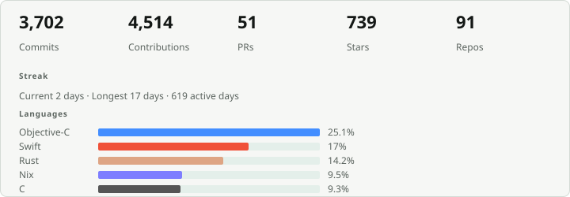

# Alex Spaulding

### Systems software · Apple platforms · Wayland compositors

[aspauldingcode.com](https://aspauldingcode.com) · Computer Science at [Eastern Washington University](https://www.ewu.edu/)

I build software close to the machine: the layers under apps. My work centers on **native compositors**, **macOS and iOS runtime tooling**, **reverse engineering**, and **Nix-based** cross-platform infrastructure.

Started programming at 10 with LEGO Mindstorms. Still happiest asking: *why does the platform prevent this, and can I redesign the architecture?*

"Build Bridges - Not Walls."

## Signature work

| Project | What it is |
|--------|------------|
| **[Wawona](https://github.com/Wawona/Wawona)** | Native Wayland compositor for macOS, iOS, and Android. Rust core, Metal and Vulkan, Nix toolchain. Nested Linux desktops, Waypipe, on-device shell. |
| **[apple-sharpener](https://github.com/aspauldingcode/apple-sharpener)** | macOS Ammonia tweak for configurable window corner radii (300+ stars). |
| **[Whisperer](https://github.com/aspauldingcode/Whisperer)** | Voice ChatGPT client for Apple Watch (Swift, watchOS). |

## Currently exploring

- Wayland and graphics pipelines on Apple and Android (`wwn-iland`, weston, waypipe, and related ports)
- macOS desktop environment research (AppKit, SkyLight, injection)
- Reproducible builds with Nix flakes and cross-compilation
- Reverse engineering tooling that feels native, including agent-driven workflows

## Languages and stack

**Day-to-day:** Objective-C · Swift · Rust · C · Nix  
**Also:** Python · Bash · Java · TypeScript (when the world insists)

**Domains:** macOS and iOS internals · Mach-O / dyld · inter-process communication · compositors · continuous integration · Fastlane / TestFlight · Ghidra / LLDB

## Student life

Bachelor of Science in Computer Science at Eastern Washington University. Transfer from the University of Montana. Coursework includes algorithms, computer architecture, C and UNIX, networks, and cybersecurity. Vice President of the Association for Computing Machinery chapter; hackathon and Capture The Flag wins; Eastern Washington University symposium poster on Wawona.

## Contact

[Website](https://aspauldingcode.com) · [Wawona](https://wawona.io) · [LinkedIn](https://www.linkedin.com/in/aspauldingcode/) · [X](https://x.com/aspauldingcode) · [Email](mailto:aspauldingcode@gmail.com)

---

<picture>
  
</picture>
